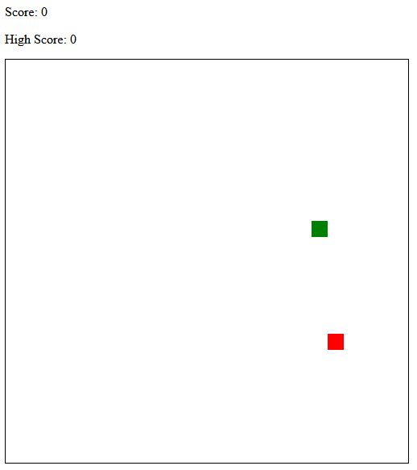

# Basic Snake Game

**The objective is simple: eat the red apple and GROW as big as possible!**

A basic HTML snake game. Open the HTML file in a browser to get started.

*Based off the tutorial at: https://developer.mozilla.org/en-US/docs/Games/Tutorials/2D_Breakout_game_pure_JavaScript*

### Details
The current score and high score are tracked at the top right. They increment by one for each eaten apple. The snake spawns in the same x,y coordinate but the apple 
is randomly spawned. Data is stored in memory as JavaScript variables and would be lost if the page is closed or refreshed.

### Images

A simple gif of the game in action. 

When the snake collides with the wall or its own tail, then a game over text pop up asking to replay or not.

